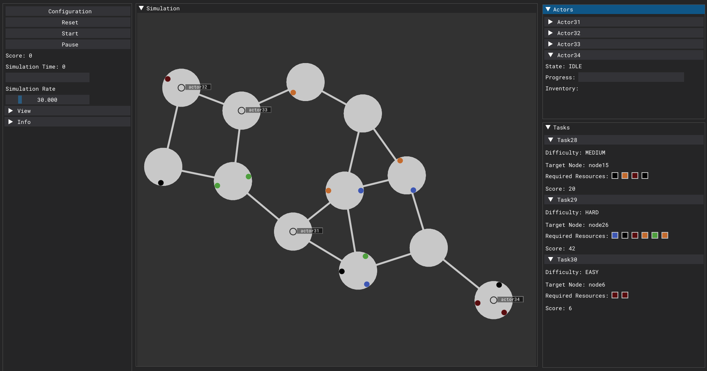

# CraftBots

CraftBots is a multi-agent simulator to evaluate/benchmark integrated planning and execution in complex tasks.



## Quickstart

Install the dependencies, clone the repository, and run `main.py`
```
pip install numpy dearpygui
git clone https://github.com/strathclyde-artificial-intelligence/craft-bots
cd ./craft-bots
python main.py
```

Press "reset" to generate a new simulation, and "start" to begin the simulation. The default agent acts randomly.

### Quick connect with your own agent

Once you have created your own agent (see [here](Creating-an-Agent) on how to make an agent) open `main.py` and modify the lines which append the default agent to the simulation.
```
    # agent
    agent = TestAgent()
    sim.agents.append(agent)
```
  
## CraftBots Wiki
Further information is available on the [CraftBots Wiki here](https://github.com/strathclyde-artificial-intelligence/craft-bots/wiki).